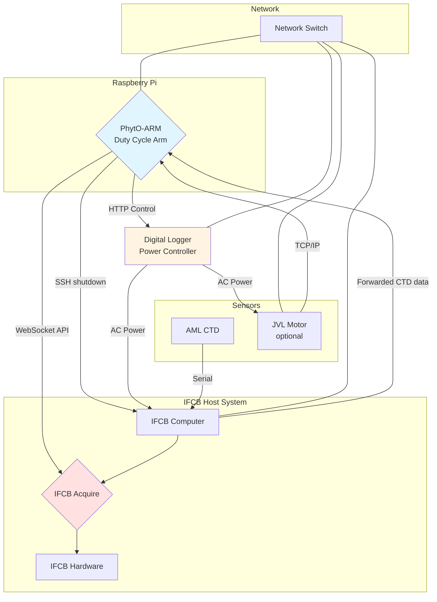

# PhytO-ARM Duty Cycle Arm

## Overview

The duty cycle arm is a specialized PhytO-ARM implementation designed for interval-based IFCB sampling with automatic power management. This arm is typically deployed on a Raspberry Pi that controls an IFCB host system, enabling scheduled sampling sessions with precise control over when the IFCB is powered on and off.

### Key Features

- **Interval-based sampling**: Schedule sampling sessions at fixed intervals (e.g., every 60 minutes)
- **Automatic power management**: Turn IFCB on/off via Digital Logger outlets
- **Graceful shutdown**: SSH-based shutdown commands to IFCB host before power cycling
- **Sample counting**: Take a specific number of samples per session before shutting down
- **Winch support**: Optional winch control for profiling and depth targeting

## Hardware Architecture



## System Behavior

### State Machine

The duty cycle arm operates in a continuous loop with the following states:

```mermaid
stateDiagram-v2
    [*] --> Initialize
    Initialize --> AwaitDutyCycle: Outside sampling window
    AwaitDutyCycle --> StartupSampling: Interval elapsed

    StartupSampling --> PowerOnIFCB
    PowerOnIFCB --> WaitForConnection
    WaitForConnection --> WaitForDepth
    WaitForDepth --> BeginProfiling

    BeginProfiling --> Upcast
    Upcast --> Downcast
    Downcast --> ProcessProfile
    ProcessProfile --> MoveToTargetDepth: Peak found
    ProcessProfile --> MoveToDefaultDepth: Peak not found

    MoveToTargetDepth --> TakeSample
    MoveToDefaultDepth --> TakeSample
    TakeSample --> CheckSampleCount

    CheckSampleCount --> Upcast: More samples needed
    CheckSampleCount --> ShutdownSampling: Target reached

    ShutdownSampling --> SyncFiles
    SyncFiles --> SendShutdownCommand
    SendShutdownCommand --> WaitForShutdown
    WaitForShutdown --> PowerOffIFCB
    PowerOffIFCB --> AwaitDutyCycle

    AwaitDutyCycle --> [*]: System stopped

    note right of SyncFiles: Optional: rsync files<br/>from IFCB to Pi
```

### Timing Example

For a configuration with:
- `interval: 60` (minutes)
- `number_of_samples: 2`
- `start_time: "2025-01-01 00:00"`

The system will operate as follows:

| Time  | Action |
|-------|--------|
| 00:00 | Session 1 starts, power on IFCB |
| 00:05 | Complete sample 1/2 |
| 00:10 | Complete sample 2/2, shutdown IFCB |
| 00:13 | IFCB powered off |
| 01:00 | Session 2 starts, power on IFCB |
| 01:05 | Complete sample 1/2 |
| ... | Pattern repeats |

## Configuration


### Key Configuration Parameters

| Parameter | Description | Default |
|-----------|-------------|---------|
| `interval` | Minutes between sampling session starts | Required |
| `number_of_samples` | Samples to take per session | Required |
| `start_time` | Reference time for interval calculations (UTC) | Current time |
| `check_interval` | How often to check if duty transition needed (sec) | 60 |
| `shutdown_wait_duration` | Wait for current sample before shutdown (sec) | 180 |
| `restart_wait_duration` | Wait for IFCB connection after power-on (sec) | 180 |
| `default_depth` | Sampling depth when no profiler peak found | 5.0 m |
| `file_sync.enabled` | Enable file syncing from IFCB to Pi | false |
| `file_sync.source_path` | Path on IFCB host to sync from | /data/ifcbdata |
| `file_sync.destination_path` | Path on Pi to sync to | /mnt/data/ifcb_sync |
| `file_sync.rsync_timeout` | Timeout for rsync operation (sec) | 600 |
| `file_sync.rsync_options` | Additional rsync options | -avz |

## Running the Duty Cycle Arm

### Using `systemd`

The default setup is to use the `phyto-arm` service installed as a systemd service. This results in the launch and monitoring of the PhytO-ARM webUI at <RPi IP address>:8080

To start/stop the service manually, use:

```bash
sudo systemctl start phyto-arm # Basic start/stop commands
sudo systemctl stop phyto-arm
sudo systemctl restart phyto-arm
sudo systemctl status phyto-arm # Run this if it isn't coming up for some reason
sudo systemctl enable phyto-arm # Start automatically on boot (default)
sudo systemctl disable phyto-arm # Prevents PhytO-ARM from starting automatically
sudo journalctl -u phyto-arm -f -n 100 # Look at system logs for the service if it's failing
```


## SSH Setup for IFCB Shutdown

The duty cycle arm sends graceful shutdown commands to the IFCB host via SSH. This requires passwordless SSH access.

### Setup Steps

1. **Generate SSH key on Pi (if not exists):**
   ```bash
   ssh-keygen -t rsa -b 4096 -C "phyto-arm-pi"
   ```

2. **Copy key to IFCB host:**
   ```bash
   ssh-copy-id ifcb@<IFCB_HOST_IP>
   ```

3. **Test passwordless login:**
   ```bash
   ssh ifcb@<IFCB_HOST_IP> echo "Connection successful"
   ```

4. **Configure IFCB host for passwordless sudo shutdown:**

   On the IFCB host, edit sudoers file:
   ```bash
   sudo visudo
   ```

   Add this line:
   ```
   ifcb ALL=(ALL) NOPASSWD: /sbin/shutdown
   ```

5. **Test shutdown command:**
   ```bash
   ssh ifcb@<IFCB_HOST_IP> "sudo shutdown -c"  # Cancel any pending shutdown
   ```

## File Syncing Setup

The duty cycle arm can automatically sync IFCB data files from the IFCB host to the Raspberry Pi before each shutdown. This provides a backup of data and enables local processing on the Pi.

### How It Works

1. After the last sample completes and before IFCB shutdown, the arm initiates an rsync transfer
2. Files are copied from the IFCB host to the Pi using SSH
3. Only new/changed files are transferred (rsync incremental sync)
4. After sync completes (or times out), normal shutdown proceeds

### Setup Steps

File syncing uses the same SSH key setup as the shutdown command:

1. **Ensure SSH key is set up** (see SSH Setup section above)

2. **Test rsync access:**
   ```bash
   rsync -avz ifcb@<IFCB_HOST_IP>:/data/ifcbdata/ /mnt/data/ifcb_sync/
   ```

3. **Create destination directory on Pi:**
   ```bash
   sudo mkdir -p /mnt/data/ifcb_sync
   sudo chown $USER:$USER /mnt/data/ifcb_sync
   ```

4. **Enable in configuration:**
   ```yaml
   arm_duty_cycle:
       tasks:
           duty_cycle:
               file_sync:
                   enabled: true
                   source_path: "/data/ifcbdata"
                   destination_path: "/mnt/data/ifcb_sync"
                   rsync_timeout: 600  # 10 minutes
                   rsync_options: "-avz --exclude='*.tmp' --exclude='*.lock'"
   ```

### Rsync Options

The `rsync_options` parameter supports standard rsync flags:

- `-a`: Archive mode (preserves permissions, timestamps, etc.)
- `-v`: Verbose output
- `-z`: Compress during transfer
- `--exclude='pattern'`: Exclude files matching pattern
- `--delete`: Delete files on destination that don't exist on source (use with caution)
- `--bwlimit=KBPS`: Limit bandwidth usage

Example for bandwidth-limited connections:
```yaml
rsync_options: "-avz --bwlimit=5000 --exclude='*.tmp'"
```

### Monitoring Sync Progress

File sync operations are logged to ROS:
```bash
# View sync logs
rostopic echo /rosout_agg | grep -i sync

# Or in journalctl if using systemd
sudo journalctl -u phyto-arm -f | grep -i sync
```

## Troubleshooting

### IFCB Won't Connect After Power-On

**Symptoms:**
- Log message: "IFCB failed to connect within timeout"
- System waits at `startup_sampling` task

**Solutions:**
1. Increase `restart_wait_duration` in config
2. Check Digital Logger outlet is actually powering the IFCB
3. Verify network connectivity between Pi and IFCB host
4. Check IFCB Acquire is configured to start automatically

### No CTD Depth Messages

**Symptoms:**
- Error: "No depth messages received after startup wait period"
- System fails at startup

**Solutions:**
1. Check CTD serial connection: `ls -l /dev/ttyS3`
2. Verify CTD is powered on
3. Check `ctd_topic` parameter matches actual topic
4. Monitor CTD topic: `rostopic echo /arm_duty_cycle/ctd/depth`
5. For RBR CTD via UDP, verify proxy is running

### IFCB Doesn't Shutdown Gracefully

**Symptoms:**
- IFCB still running after shutdown command
- SSH timeout errors in logs

**Solutions:**
1. Verify SSH passwordless access is working
2. Check sudoers file for shutdown permission
3. Increase SSH timeout in code if network is slow
4. Verify IFCB host IP address in config

### File Sync Fails or Times Out

**Symptoms:**
- Error: "File sync failed with return code X"
- Error: "File sync timed out"
- Shutdown proceeds despite sync failure

**Solutions:**
1. Test rsync manually: `rsync -avz ifcb@<HOST>:/data/ifcbdata/ /mnt/data/ifcb_sync/`
2. Check SSH key is set up correctly (same as shutdown setup)
3. Verify destination directory exists and is writable
4. Check network connectivity between Pi and IFCB
5. If large dataset, increase `rsync_timeout` in config
6. Monitor disk space on Pi: `df -h /mnt/data`
7. Check IFCB disk space: `ssh ifcb@<HOST> df -h`
8. Use `--bwlimit` if network bandwidth is limited
9. Add more `--exclude` patterns to skip unnecessary files

### File Sync Takes Too Long

**Symptoms:**
- Sync times out before completing
- Long delays before shutdown

**Solutions:**
1. Increase `rsync_timeout` in configuration
2. Limit bandwidth if competing with other network traffic: `rsync_options: "-avz --bwlimit=5000"`
3. Exclude large unnecessary files: `--exclude='*.avi' --exclude='*.mov'`
4. Consider syncing only recent data: use rsync filters
5. Run periodic manual syncs between duty cycles to keep incremental syncs small
6. Check if network connection is slow or unstable
