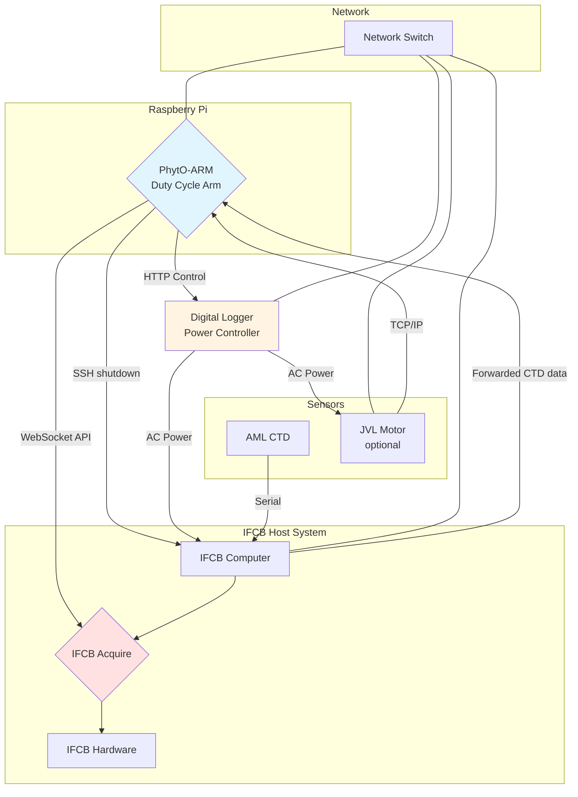
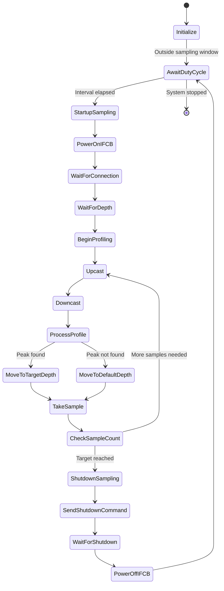

# PhytO-ARM Duty Cycle Arm

## Overview

The duty cycle arm is a specialized PhytO-ARM implementation designed for interval-based IFCB sampling with automatic power management. This arm is typically deployed on a Raspberry Pi that controls an IFCB host system, enabling scheduled sampling sessions with precise control over when the IFCB is powered on and off.

### Key Features

- **Interval-based sampling**: Schedule sampling sessions at fixed intervals (e.g., every 60 minutes)
- **Automatic power management**: Turn IFCB on/off via Digital Logger outlets
- **Graceful shutdown**: SSH-based shutdown commands to IFCB host before power cycling
- **Sample counting**: Take a specific number of samples per session before shutting down
- **Winch support**: Optional winch control for profiling and depth targeting

## Hardware Architecture



## System Behavior

### State Machine

The duty cycle arm operates in a continuous loop with the following states:



### Timing Example

For a configuration with:
- `interval: 60` (minutes)
- `number_of_samples: 2`
- `start_time: "2025-01-01 00:00"`

The system will operate as follows:

| Time  | Action |
|-------|--------|
| 00:00 | Session 1 starts, power on IFCB |
| 00:05 | Complete sample 1/2 |
| 00:10 | Complete sample 2/2, shutdown IFCB |
| 00:13 | IFCB powered off |
| 01:00 | Session 2 starts, power on IFCB |
| 01:05 | Complete sample 1/2 |
| ... | Pattern repeats |

## Configuration


### Key Configuration Parameters

| Parameter | Description | Default |
|-----------|-------------|---------|
| `interval` | Minutes between sampling session starts | Required |
| `number_of_samples` | Samples to take per session | Required |
| `start_time` | Reference time for interval calculations (UTC) | Current time |
| `check_interval` | How often to check if duty transition needed (sec) | 60 |
| `shutdown_wait_duration` | Wait for current sample before shutdown (sec) | 180 |
| `restart_wait_duration` | Wait for IFCB connection after power-on (sec) | 180 |
| `default_depth` | Sampling depth when no profiler peak found | 5.0 m |

## Running the Duty Cycle Arm

### Using `systemd`

The default setup is to use the `phyto-arm` service installed as a systemd service. This results in the launch and monitoring of the PhytO-ARM webUI at <RPi IP address>:8080

To start/stop the service manually, use:

```bash
sudo systemctl start phyto-arm # Basic start/stop commands
sudo systemctl stop phyto-arm
sudo systemctl restart phyto-arm
sudo systemctl status phyto-arm # Run this if it isn't coming up for some reason
sudo systemctl enable phyto-arm # Start automatically on boot (default)
sudo systemctl disable phyto-arm # Prevents PhytO-ARM from starting automatically
sudo journalctl -u phyto-arm -f -n 100 # Look at system logs for the service if it's failing
```


## SSH Setup for IFCB Shutdown

The duty cycle arm sends graceful shutdown commands to the IFCB host via SSH. This requires passwordless SSH access.

### Setup Steps

1. **Generate SSH key on Pi (if not exists):**
   ```bash
   ssh-keygen -t rsa -b 4096 -C "phyto-arm-pi"
   ```

2. **Copy key to IFCB host:**
   ```bash
   ssh-copy-id ifcb@<IFCB_HOST_IP>
   ```

3. **Test passwordless login:**
   ```bash
   ssh ifcb@<IFCB_HOST_IP> echo "Connection successful"
   ```

4. **Configure IFCB host for passwordless sudo shutdown:**

   On the IFCB host, edit sudoers file:
   ```bash
   sudo visudo
   ```

   Add this line:
   ```
   ifcb ALL=(ALL) NOPASSWD: /sbin/shutdown
   ```

5. **Test shutdown command:**
   ```bash
   ssh ifcb@<IFCB_HOST_IP> "sudo shutdown -c"  # Cancel any pending shutdown
   ```

## Troubleshooting

### IFCB Won't Connect After Power-On

**Symptoms:**
- Log message: "IFCB failed to connect within timeout"
- System waits at `startup_sampling` task

**Solutions:**
1. Increase `restart_wait_duration` in config
2. Check Digital Logger outlet is actually powering the IFCB
3. Verify network connectivity between Pi and IFCB host
4. Check IFCB Acquire is configured to start automatically

### No CTD Depth Messages

**Symptoms:**
- Error: "No depth messages received after startup wait period"
- System fails at startup

**Solutions:**
1. Check CTD serial connection: `ls -l /dev/ttyS3`
2. Verify CTD is powered on
3. Check `ctd_topic` parameter matches actual topic
4. Monitor CTD topic: `rostopic echo /arm_duty_cycle/ctd/depth`
5. For RBR CTD via UDP, verify proxy is running

### IFCB Doesn't Shutdown Gracefully

**Symptoms:**
- IFCB still running after shutdown command
- SSH timeout errors in logs

**Solutions:**
1. Verify SSH passwordless access is working
2. Check sudoers file for shutdown permission
3. Increase SSH timeout in code if network is slow
4. Verify IFCB host IP address in config
