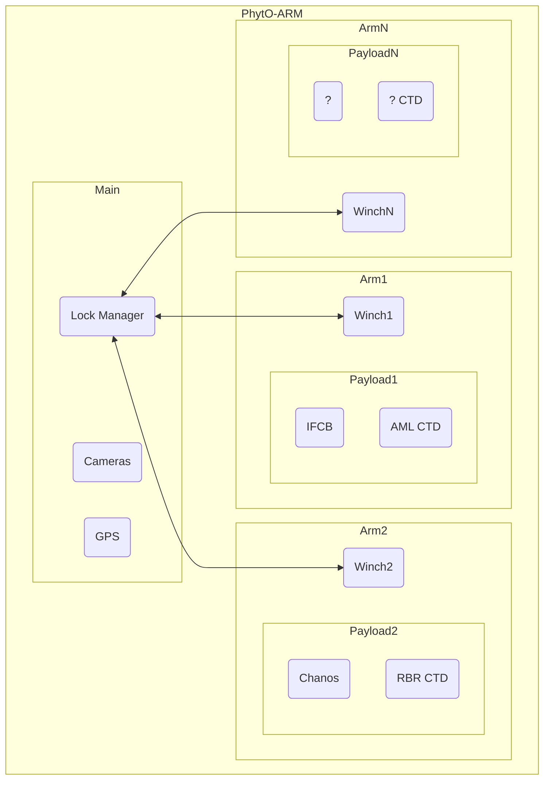
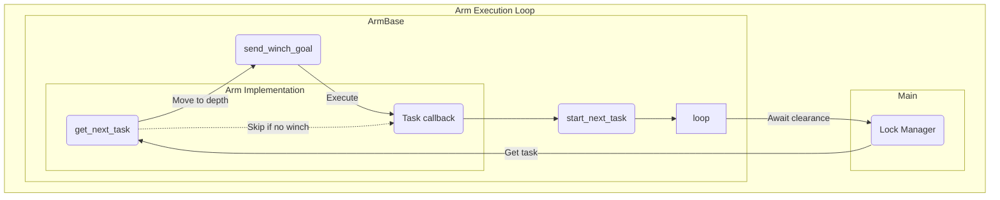
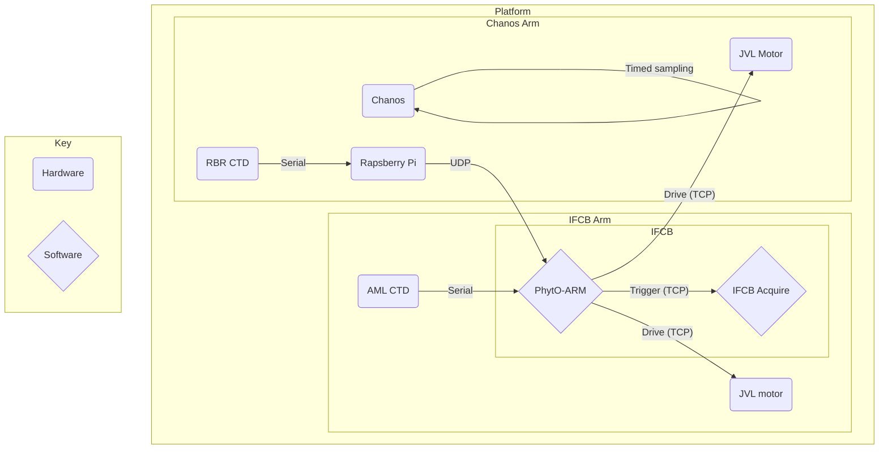

# PhytO-ARM

PhytO-ARM is robot operating system (ROS)-based toolkit for integration of Imaging FlowCytobot ([IFCB][mclane]) and other ocean sensors that are commonly deployed by the [Brosnahan Lab][blab]. The supported ROS release is [Noetic Ninjemys][noetic].

There are instructions for assembling a profiling configuration at our accompanying [PhytO-ARM][parm] website. The profiling system consists of an IFCB, an [AML ctd][aml], and a winch built from a [JVL servo motor][jvl] and parts from [Conedrive][cdrive] and [Waterman Industries][wiparts]. Once assembled, code provided here enables a variety of continuous sampling behaviors including continuous CTD profiling and targeted collection of IFCB samples at chlorophyll maxima. Other scientific payloads are also supported, and PhytO-ARM can coordinate an arbitrary number of winches running concurrently.

PhytO-ARM observations of location, depth, water properties, etc. are written to IFCB metadata files at time of collection for distribution through an existing webservices system called [IFCB dashboard][ifcbdb]. Additional scripts are provided for export to [CF-compliant NetCDF][cfnet] data formats and upload to repositories like the [NOAA ERDDAP][nerddap] system.

During and after deployments, system operators can review system data using standard ROS tools like [FoxGlove Studio][fglove].

  [mclane]: https://mclanelabs.com/imaging-flowcytobot/
  [blab]: https://www2.whoi.edu/site/brosnahanlab/
  [noetic]: http://wiki.ros.org/noetic
  [parm]: https://phyto-arm.whoi.edu
  [aml]: https://amloceanographic.com/instrumentation
  [jvl]: https://www.jvl.dk/703/mac400-integrated-servo-motor
  [cdrive]: https://conedrive.com/products/products-2-2/gear-sets-materials-specials-etc-2/
  [wiparts]: https://hiliner.com/product-catalog/deep-water-reels/waterman-industries-deep-drop-reels-replacement-spools-and-spring-arms/
  [cfnet]: http://cfconventions.org
  [nerddap]: https://www.ncei.noaa.gov/erddap/index.html
  [fglove]: https://foxglove.dev/studio


## Contents

Three types of ROS nodes are provided. Device nodes enable integration of IFCB, CTD, GPS, servo, and IP camera systems. Behavior nodes interpret device node data streams and direct changes in system behavior. System nodes log ROS traffic and make it available for real-time interactive display (Rosbridge).

## Hardware Dependencies
The following are **required** for PhytO-ARM to run:
- CTD (AML and RBR currently supported)
- GPS (gpsd service must be present, but device itself can be absent)

The following devices are optional:
- IFCB with IFCBacquire running
- JVL motor (see `example.yaml` for how to enable/disable)
- IP Camera


## Installation


### Install with Docker (recommended)

First ensure `docker` is installed:
```bash
docker -v
```

If this does not print a version number, install with:
```bash
sudo apt-get update && sudo apt-get install docker-io
```

Running Docker will also require `sudo` unless you add your user to the `docker` group:

```bash
# Adds user 'ifcb' to 'docker' group
sudo usermod -aG docker ifcb && newgrp docker
```


Finally, pull the `phyto-arm` image. Container images are built for `x86_64` and `aarch64` and published automatically on [Docker Hub][hub] by the continuous integration system.

```bash
docker pull whoi/phyto-arm:latest
```

Alternatively, the container image can be built with

    docker build --tag whoi/phyto-arm .

  [hub]: https://hub.docker.com/repository/docker/whoi/phyto-arm


### Install natively

These instructions are for install of nodes on an IFCB running Debian 10 ("Buster") OS. Additional instructions are provided for installation as dockerized components that may be distributed across several systems on a network.

These steps assume that ROS Noetic has been installed already.

    source /opt/ros/noetic/setup.bash

    # Install apt package dependencies
    sed 's/#.*//' deps/apt-requirements.txt | envsubst \
        | xargs sudo apt install -y

    # Clone source dependencies
    vcs import src < deps/deps.rosinstall

    # Install ROS dependencies
    sudo rosdep init
    rosdep update
    rosdep install --default-yes --from-paths ./src --ignore-src

    # Patch build configuration for cv_bridge
    # https://github.com/ros-perception/vision_opencv/issues/345
    sudo sed -i 's,/usr/include/opencv,/usr/include/opencv4,g' \
        /opt/ros/noetic/share/cv_bridge/cmake/cv_bridgeConfig.cmake

    # Create Python virtual environment
    python3 -m virtualenv .venv --system-site-packages
    . venv/bin/activate
    python3 -m pip install -r deps/python3-requirements.txt

    # Create Catkin workspace
    catkin init

    # Build
    catkin build phyto_arm

    # Add user to dialout group (takes effect on next login)
    sudo usermod -a -G dialout $USER


### Install as a service

    sudo ln -sf $(pwd)/phyto-arm.service /etc/systemd/system/phyto-arm.service
    sudo systemctl daemon-reload
    sudo systemctl enable phyto-arm
    sudo systemctl start phyto-arm


## Running 

### Using ROS Launchpad (NEW)

ROS Launchpad is a simple web dashboard for managing ROS processes and config. The default Docker command will start it up, so simply starting the container is sufficient. `./scripts/docker_run.sh -d` will also run the dashboard.

### Using `phyto-arm`

The `phyto-arm` tool starts all of the ROS nodes and loads the provided configuration file. This is typically run within the container.

```
phyto-arm start [-h] [--config_schema <schema file>] [--skip_validation] \
  <launchfile name> <config file>

positional arguments:
<launchfile name>
  Name of ROS launchfile to use in the phyto_arm package, excluding extension.
  Currently one of 'main', 'arm_ifcb' or 'arm_chanos'.

<config file>
  Path to YAML config file.

options:
-h, --help
  Show help message.
--config_schema <schema file>
  File to validate config against.
--skip_validation
  Skip validation check altogether.
```

If running natively, you may kill the process with:
```bash
phyto-arm stop
```

Below is an example Docker run script which includes both the `phyto-arm` command as well as the necesssary docker parameters to access devices, ports, and directories on the host. For your convenience, this command is also available as a script in `scripts/docker_run.sh`.
```bash
docker run --rm -it \
    # Name of the container in docker
    --name phyto-arm \
    # Expose whatever port is being used by Foxglove
    --publish 9090:9090/tcp \
    # Expose whatever port is being used by web_node
    --publish 8098:8098/tcp \
    # If using an RBR CTD streaming over UDP, open the necessary port
    --publish 12345:12345/udp \
    # Bind config directory host:container. ':ro' = read-only
    --volume "$(pwd)"/configs:/configs:ro \
    # Bind IFCBAcquire routines directory host:container
    --volume /home/ifcb/IFCBacquire/Host/Routines:/routines:ro \
    # host:container bind for saving files to host, in this case
    # for the log_dir and rosbag_prefix settings in example.yaml
    --volume /mnt/data:/mnt/data \
    # If using an AML CTD over serial, give access to device
    --device /dev/ttyS3 \
    # Name of Docker image:tag to use
    whoi/phyto-arm:latest \
    # Start command. Change to use desired config file, should be
    # in the container config directory mapped above.
    ./phyto-arm start main /configs/config.yaml
```

The above script will start the main PhytO-ARM processes, but not launch any of the winch "arms" where science missions are defined. Currently there are two science payload implementations, for IFCB missions and Chanos sensor missions, called `arm_ifcb` and `arm_chanos` respectively. 

Launching the arms independently means they can also be stopped, configured, and relaunched without interrupting other PhytO-ARM missions in progress.

After launching `main` with the script above, you can launch the arms with the following commands:
```bash
docker exec -it phyto-arm ./phyto-arm start arm_ifcb /configs/config.yaml
```
and
```bash
docker exec -it phyto-arm ./phyto-arm start arm_chanos /configs/config.yaml
```

To launch all three simultaneously as separate panes in a tmux session, run the `scripts/tmux_run.sh` script. Running this a second time will attach you to the existing session. To kill the session and all processes running within, use the `scripts/tmux_kill.sh` script.

### Running natively

*Not recommended*: Running as a Docker container is preferable in most scenarios.

Source any environments that are in use:
```
. venv/bin/activate # Python environment
. devel/setup.bash  # ROS environment
```

The `phyto-arm` tool starts the main ROS nodes and loads the provided configuration file.

    $ ./phyto-arm start main config/config.yaml
    $ ./phyto-arm stop

In seperate terminal sessions, launch one or more arms:

    $ ./phyto-arm start arm_chanos config/config.yaml
    $ ./phyto-arm start arm_ifcb config/config.yaml

The ROS nodes will be run in the background (so that you can disconnect from the system, for example).

**Note:** All instruments must already be logging data. Some notes on configuring instruments are included below.

### Hardware mocking

Note that there are also launch files which substitute the IFCB, CTDs and motors for mock versions, suitable for local development and testing. These can be launched as:
```bash
docker exec -it phyto-arm start mock_arm_ifcb /configs/config.yaml
```
and
```
docker exec -it phyto-arm start mock_arm_chanos /configs/config.yaml
```

### Unit tests

To run unit tests, execute
```bash
docker run -it --rm whoi/phyto-arm:latest /bin/bash -c "source devel/setup.bash && catkin test phyto_arm"
```

## Configuration

Configuration files live in `configs/` and use the YAML format. It is recommended that each deployment get its own configuration. An example config file is provided in `example.yaml`.

### Config validation

A strict YAML schema is not defined, instead another YAML file is used as a schema to compare against at runtime. `configs/example.yaml` is used by default, and validation is done by comparing both structure and data types.

You can skip validation by passing the `--skip_validation` argument to `phyto-arm`.

You can also provide your own schema by passing in the `--config_schema <file>` argument to `phyto-arm`. A few rules on how validation is completed:

  1. By default, all parameters in the schema file must also exist in the config file.
  2. Lines that contain `#optional` are not required.
  3. The datatype for every parameter present in both config and schema must match.
  4. Parameters in config but not schema are ignored.

For more information see https://github.com/WHOIGit/example-yaml-validator


### Configuring host address

When running in a container, ensure the config YAML refers to the Docker host's IP address of `172.17.0.1` instead of using `localhost` when trying to access host services, such as in the config for `/gps/host` and `/ifcb/address`.

### Changing config at runtime

The entries in the config file are loaded into the ROS [Parameter Server][]. Some parameters can be dynamically changed while the nodes are running:

    $ source devel/setup.bash
    $ rosparam get /conductor/schedule/every
    60
    $ rosparam set /profiler/data_topic /ctd/aml/port3/chloroblue

Be sure to make the corresponding edits to the config file to persist changes beyond the current session.

  [Parameter Server]: https://wiki.ros.org/Parameter%20Server


## Instrument-specific configurations

### AML CTD

Use `picocom` to to talk to the appropriate serial device. Press <kbd>Enter</kbd> first to interrupt any current logging and get a prompt. Run the commands below in picocom to configure the AML output correctly.

    $ picocom -b 115200 /dev/ttyS3
    > set derive depth y
    > set scan dep
    > set derive salc y
    > set scan sal
    > set derive density y
    > set scan den
    > set scan raw
    > mmonitor
    ...

Press <kbd>Ctrl-A</kbd>, <kbd>Ctrl-X</kbd> to exit `picocom` while the device is logging.

The time must be set to UTC. To sync the clock, you can use:

    (echo; echo "set fulltime $(date -u "+%Y-%m-%d %H:%M:%S")") \
    | picocom -b 115200 /dev/ttyS3

### RBR CTD

The current setup of the Chanos arm assumes the RBR CTD data is being transmitted to the host over UDP. In our setup, a proxy is running on a Raspberry Pi Zero which has a serial connection to the RBR, and forwards the CTD messages over UDP to the host.

The proxying script used is provided in `rbr_relay.sh`, a systemd service equivalent is also provided in `rbr_relay.service`.

The `udp_to_ros.py` node is used to read the proxied UDP packets and publish them on a ROS topic to be used by PhytO-ARM.


### GPS

GPS tracking is provided via [gpsd][].

  [gpsd]: https://gpsd.gitlab.io/gpsd/index.html

    sudo apt install -y gpsd gpsd-clients

On Ubuntu, edit `/etc/default/gpsd` to configure the GPS device or network source. For example, to listen for UDP packets broadcast on the local network:

    DEVICES="udp://192.168.13.255:22335"

Monitor that GPS updates are being received using `gpsmon`.

When running in a container, the gpsd service on the host needs to be modified to accept inbound connections from the container. Use `systemctl edit gpsd.socket` to create an override file:

    # Allow clients to connect to gpsd from Docker.
    # Based on https://stackoverflow.com/q/42240757
    [Socket]
    ListenStream=
    ListenStream=/var/run/gpsd.sock
    ListenStream=0.0.0.0:2947


### Other board configuration

Additional Ubuntu configuration that may be necessary to ensure GPS stays powered on and available.

Adding to the IP above, change `/etc/default/gpsd` to:
```bash
# Default settings for the gpsd init script and the hotplug wrapper.

# Start the gpsd daemon automatically at boot time
START_DAEMON="true"

# Use USB hotplugging to add new USB devices automatically to the daemon
USBAUTO="false"

# Devices gpsd should collect to at boot time.
# They need to be read/writeable, either by user gpsd or the group dialout.
DEVICES="udp://192.168.13.255:22335"

# Other options you want to pass to gpsd
GPSD_OPTIONS=""
```
Then use `systemctl edit gpsd.service` (may have to invoke sudo) and set the override file to:
```bash
# Always start GPSD, even if no one is connected to the socket
[Install]
WantedBy=multi-user.target
```


## Deployment Checklist

- [ ] Config: YAML file created, compare against `example.yaml`
- [ ] CTD(s): hardware installed and powered on
- [ ] AML CTD: Used picocom to configure AML
- [ ] AML CTD: Confirmed broadcasting in `picocom`
- [ ] AML CTD: Device set correctly in config YAML
- [ ] AML CTD: Device mapped to container (if using Docker)
- [ ] RBR CTD: Raspberry Pi relay setup and powered on
- [ ] RBR CTD: Receiving UDP packets on host with `nc -lup 12345`
- [ ] RBR CTD: Port mapped to container (if using Docker)
- [ ] GPS: `gpsd` installed and running
- [ ] GPS: If used, GPS device plugged in and IP configured
- [ ] IP camera: IP reserved and set correctly in config YAML
- [ ] Motor(s): If used, plugged in and outlets on
- [ ] Motor: `launch_args/ifcb_winch` set to true if used, false otherwise
- [ ] Motor: `launch_args/chanos_winch` set to true if used, false otherwise
- [ ] Motor(s): IPs reserved
- [ ] Motor(s): Ensure IP for each motor matches correct arm in YAML config
- [ ] Foxglove: If using container, Foxglove bridge port is exposed
- [ ] Data: Rosbag, data and logs directory exist as set in config YAML
- [ ] Data: If using container, data directory volumes are mounted
- [ ] IFCBacquire: Routines directory populated
- [ ] IFCBacquire: web_node server port exposed if using container
- [ ] IFCBacquire: Started and values set
- [ ] IFCB: Address, port, serial set in config YAML
- [ ] IFCB: Liquids loaded
- [ ] When ready, run PhytO-ARM for a cycle to confirm no errors


# Development

To develop in PhytO-ARM, it is recommended to use a development container with the provided development container configuration file. This can be done locally or on a remote machine (e.g. an IFCB).

1. Install Visual Studio Code.
2. After cloning the PhytO-ARM repository, open the directory in VS Code. If developing remotely, use Microsoft's _Remote SSH_ extension to open the folder on the remote device. 
3. Open the `.devcontainer/devcontainer.json` configuration file. You may need to comment out any lines which depend on hardware (e.g., `/dev/ttyS3`) or folders (e.g. `/home/ifcb`) not present on your development machine.
4. Install the _Dev Containers_ extension published by Microsoft.
5. The extension should automatically detect the existing `devcontainer.json` configuration and prompt you to reopen the project as a development container.
6. Wait for the container to open. The first time may be slow as it builds the development image, expect to wait 10 minutes or longer depending on your hardware and Internet connection.

The development container allows you to develop and test from an environment identical to that used in production. If developing locally, launch arms with mocked hardware (see _Running_ section above).

The `.git` repository folder is also mounted in the development container, making it possible to pull/commit/push as needed from within the container.

### Architecture

PhytO-ARM has evolved to handle multiple mission types and deployment configurations. Deployments so far include single-winch on a stationary platform, winchless on an autonomous surface vehicle, and multi-winch on a stationary platform.

PhytO-ARM has been modularized to support any configuration of winch and scientific payload. Scientific payloads are isolated into distinct "arms", each of which may have a winch providing movement for that arm. All arms should implement `ArmBase`, an interface class which handles winch movement logic and coordinates movement between arms by communicating with a central `lock_manager` node. 

`lock_manager` is primarily to limit how many winches can move concurrently, as configured by the parameter `/lock_manager/max_moving_winches`. This is primarily to accommodate missions which may require inter-arm coordination, or to prevent overdraw of power on battery-powered setups.

PhytO-ARM comes with two arm implementations included, see `arm_ifcb.py` and `arm_chanos.py` in the `phyto_arm` package. Any number of arms is supported however, as illustrated below. Each box represents a set of nodes with an independent launch file.



### Mission Tasks

Each arm implementing `ArmBase` must override `get_next_task`, which is the basis of an event loop where all decisions are made on which task to perform next. `get_next_task` is passed the previous task as context, and should return a new task containing movement instructions and a callback that will be executed when the movement completes.



The history of task states can be reconstructed via the task names published at `/<arm name>/task`.

### Hardware topology

In all deployments thus far, we have used the IFCB as the primary host to run PhytO-ARM and coordinate movements and sampling. The hardware architecture diagram below illustrates this. 




## Node Inventory

Note that ROS path conventions are used, such that paths beginning with `/` are absolute, paths beginning with `~` start at the node, and paths without a prefix are relative to their namespace. Global namespace is used for main nodes, while `arm_ifcb` and `arm_chanos` namespaces are used for the IFCB and Chanos arms, respectively.

### Behavior nodes

These nodes implement the core PhytO-ARM "algorithm" for sampling and are specific to the design of the platform.

  - `lock_manager`: Winch traffic control center, limits number of concurrent winch movements.
    - Publishes:
      - `~acquire` for arms to request permission to move their winches
      - `~release` for arms to release permission to move
      - `~check` for arms to check whether they might have a dangling lock (e.g. after a crash or user stop)

  - `arm_base`: Common task management capabilities for payloads, such as determining whether to move winch and enforcing geofence limits.
    - Publishes:
      - `~task`: Name of the current task being executed by the arm.

  - `arm_ifcb`: Orchestrates IFCB payload behaviors
    - Subscribes:
      - `ifcb_runner/sample` to run IFCB sampling actions
      - `profiler` for profile data, especially phy peak
      - `winch/move_to_depth/result` to determine the success of a transit
      - `lock_manager/acquire` for getting clearance to move a winch. Some configurations may not permit simultaneous winch movements
      - `lock_manager/release` to inform the semaphore that movement has completed
      - `lock_manager/check` check for dangling locks

  - `ifcb_runner`: Provides one high-level action for running IFCB samples
    - Subscribes:
      - `/ifcb/in` for IFCB status messages
    - Publishes:
      - `~state` current state for debugging purposes
      - `~sample/goal` action server for running IFCB sampling routines
      - `~sample/feedback` sampling action feedback
      - `~sample/result` sampling action result

  - `mock_ifcb_runner`: Mock version of `ifcb_runner`
    - Publishes:
      - `~state` current state for debugging purposes
      - `~sample/goal` action server for running mock sampling routines
      - `~sample/feedback` sampling action feedback
      - `~sample/result` sampling action result

  - `arm_chanos`: Orchestrates Chanos sensor payload behaviors
    - Subscribes:
      - `winch/move_to_depth/result` to determine the success of a transit
      - `lock_manager/acquire` for getting clearance to move a winch
      - `lock_manager/release` to inform the semaphore that movement has completed
      - `lock_manager/check` to check for dangling locks

  - `profiler`: Creates profiles of CTD data during a cast
    - Subscribes:
      - user-chosen topic provided in config
    - Publishes:
      - `~` with *resampled* profile data
      - `~downcast` as above, but only downcasts
      - `~downcast` as above, but only upcasts

  - `web`: Web API for attaching metadata to IFCB bins
    - Subscribes:
      - `/gps/fix` for GPS fixes

  - `winch`: Controls depth using the motor
    - Subscribes:
      - `ctd/depth` for monitoring depth
      - `motor/motion` for monitoring motor state
      - `winch/move_to_depth/goal` for setting the goal depth
      - `winch/move_to_depth/cancel` for canceling the current goal
    - Publishes:
      - `winch/move_to_depth/feedback` with progress updates
      - `winch/move_to_depth/status` with the status of the current goal
      - `winch/move_to_depth/result` with the result of the goal

  - `mock_winch_node`: Mock version of `winch`
    - Publishes:
      - `winch/move_to_depth/feedback` with progress updates
      - `winch/move_to_depth/status` with the status of the current goal
      - `winch/move_to_depth/result` with the result of the goal

### Device nodes (drivers)

These nodes perform lower-level interactions with hardware components. These nodes are designed to be portable to future projects.


  - `camera`: Video stream
    - Publishes:
      - `~image/compressed` with the compressed video feed

  - `ctd`: Driver for the AML or RBR maestro3 CTD
    - Subscribes:
      - `ctd_comms/in` for receiving data from CTD.
    - Publishes:
      - `~ctd` with conductivity, temperature, and pressure data
      - `~depth` with depth and pressure data
      - `~aml/derive/xyz` with derived values (for AML only)
      - `~aml/port#/xyz` with measured values (for AML only)

  - `ctd_comms`: Bridge for CTD serial communications
    - Publishes:
      - `ctd_comms/in` for messages received from the CTD's serial port
      - `ctd_comms/out` for messages sent to the CTD's serial port

  - `udp_to_ros`: Translates UDP messages to ROS topics. Used for receiving proxied RBR data.
      - Publishes:
        - `udp_stream` a continuous stream of all received UDP messages.

  - `gps`: Provides GPS fixes to ROS from `gpsd`
    - Publishes:
      - `/gps/fix` and `/gps/extended_fix`

  - `ifcb`: Bridge for the IFCB websocket API
    - Publishes:
      - `~in` for messages received from the IFCB
      - `~out` for messages sent to the IFCB
      - `~image` for full-frame images
      - `~roi/image` for detected ROI images only
      - `~roi/image/raw` republished ROI as raw (if classifier enabled)
      - `~roi/markers` with rectangular bounds of ROIs
    - Services:
      - `~command` to send a message to the IFCB
      - `~routine` to send a routine to the IFCB

  - `motor`: Driver for the JVL motor
    - Publishes:
      - `~electrical` with electrical registers
      - `~error` with error registers
      - `~motion` with motion registers
    - Services:
      - `~set_position` to set the motor's position
      - `~set_position_envelope` to set position limits
      - `~set_velocity` to set the motor's velocity
      - `~stop` to stop the motor

  - `mock_ctd`: Mock version of a CTD publisher
    - Publishes:
      - `~ctd` with conductivity, temperature, and pressure data
      - `~depth` with depth and pressure data


### System nodes

These nodes provide functionality for recording data and connecting to other tools like Foxglove Studio.

  - `rosbag_record`: Records ROS traffic to ROS bag files
    - Publishes:
      - `/begin_write` when a new bag file is created

  - `rosbridge_websocket`: Rosbridge server for Foxglove Studio

  - `rosout`: Logging mechanism
    - Subscribes:
      - `/rosout` for log messages from each node
    - Publishes:
      - `/rosout_agg` with copies of all log messages


## Style guide (beta)

1. Place a blank newline before comment lines to make them easier to spot, e.g.
```
# First comment
val1 = 'some value'

# Second comment
val2 = 'next value'
```
A style guide has not yet been rigorously defined, this section will expand as new policies are adopted.


## Observing with Foxglove Studio

[Foxglove Studio][] is the recommended software for monitoring the PhytO-ARM system. To connect to a live system, use the "ROS Bridge WebSocket" connection type.

The ROS Bridge node uses TCP port 9090. Ensure this port is forwarded in your router settings *for trusted clients only*, or use SSH port forwarding:

    $ ssh -NL 9090:localhost:9090 <PhytO-ARM host address>

In Studio, the connection address is `ws://<PhytO-ARM host address>:9090` if connecting directly or `ws://localhost:9090` if using the SSH tunnel.

  [Foxglove Studio]: https://foxglove.dev

**Tip:** For the most accurate time series plots, configure plot lines to use a message's `header.stamp` rather than its receive time, which is affected by network latency.


## Data Logs

Data is logged to the ROS bag format using the `rosbag record` command. Bag files can also be viewed with Foxglove Studio.

Almost all internal ROS traffic is logged, with the exception of the camera feed (due to storage requirements) and ROS service calls (due to technical limtations).

The config file controls where the bag files are written:

    launch_args:
        rosbag_prefix: /mnt/data/rosbags/phyto-arm_hades

This results in files in the `/mnt/data/rosbags/` directory with names like `phyto-arm_hades_2022-04-01-14-47-11_0.bag`. The name includes the timestamp of when PhytO-ARM was started, plus a numeric counter. A new bag is created, incrementing the counter, when a configured size limit is reached.

A bag file with the suffix `.active` is currently being written, or was left in an incomplete state by a previous session that was terminated abruptly. Such files can sometimes be repaired.


