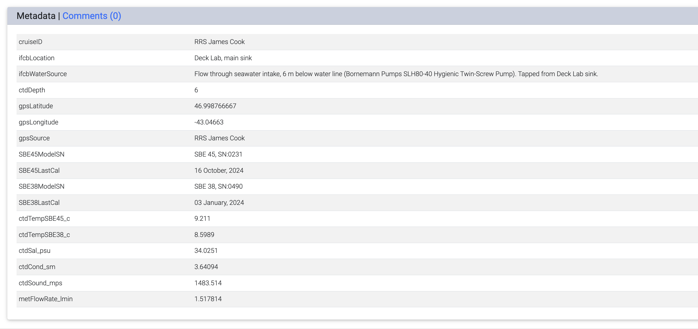

# Deployment Configuration for R/V *Sikuliaq*

Notes from setup of **PhytO-ARM** for capture of shipboard data by IFCBacquire on the R/V *Sikuliaq*. 

This PhytO-ARM deplopyment configuration is compatible with an IFCB running the stock McLane disk image (Debian 10 OS) or containerized IFCBacquire. PhytO-ARM is installed and runs on a **Raspberry Pi 5 (RPi5)**. GPS data, flow-through seawater sensor data, and meteorological tower observations from the R/V Sikuliaq are written to IFCB HDR files via the web_node.

Operation of PhytO-ARM has been streamlined to capture ship data streams and re-publish this data for inclusion in IFCB header files. The script `docker_run.sh` has been updated to launch only the **master node**. 


PhytO-ARM starts automatically on boot of the RPi5 when installed as a `systemd` service. The IFCB does **not** begin sampling until an operator logs into the IFCBacquire WebUI and clicks **Start Acquisition**. Sampling is stopped via **Stop Acquisition** in the WebUI, and other IFCBacquire settings may be modified as usual, independent of PhytO-ARM operation.

If deployed on the R/V *Sikuliaq* with the same UDP ship data streams, few (if any) changes should be required for a successful deployment.

## Table of Contents

- [Hardware Components](#hardware-components)
- [Raspberry Pi 5 Setup](#raspberry-pi-5-setup)
- [IFCB Setup](#ifcb-setup)
- [PhytO-ARM Installation on the RPi5](#phyto-arm-installation-on-the-rpi5)
- [GPS configuration](#gps-configuration)
- [Capturing Ship Data using Network Data Capture](#capturing-ship-data-using-network-data-capture)
- [Troubleshooting Ship Flowthrough Data](#troubleshooting-ship-flowthrough-data)
- [Optional remote power cycling](#optional-remote-power-cycling)
- [Operation](#operation)

---
## Hardware Components

1. IFCB
2. Raspberry Pi 5 (RPi5)
3. Netgear ProSafe 5-Port Gigabit Switch
4. [Optional] Digital Loggers IoT Power Relay (for outlet control via RPi5)

---

## Raspberry Pi 5 Setup

The RPi5 is running **Ubuntu 24.04**. The system microSD card (SanDisk 256 GB Extreme PRO®) was flashed using **Raspberry Pi Imager v1.9.4** on macOS.

The following packages need to be installed with apt-get:

- `openssh-server`
- `rsync`
- `git`
- `gpiod`
- `gpsd`
- `gpsd-clients`
- `curl`

Then, enable OpenSSH service:

```bash
sudo systemctl enable ssh
sudo systemctl start ssh
sudo systemctl status ssh
```

And edit `/etc/ssh/sshd_config` to allow RSA key and password authentication:
```bash
sudo nano /etc/ssh/sshd_config
```

Ensure:
```bash
PubkeyAuthentication yes
PasswordAuthentication yes
```
Restart SSH after making changes:
```bash
sudo systemctl restart ssh
```

Operators will need to establish remote access to the RPi if operating/accessing PhytO-ARM off ship. This could be a remote desktop service like AnyDesk.

### RPi5 Network Configuration

Prior to installation aboard the R/V Sikuliaq, obtain and provide the appropriate MAC address to the ship technician so a static IP assignment can be configured in advance:

- Ethernet MAC address if connecting directly to the ship network via ethernet cable.
- WLAN (Wi-Fi) MAC address if connecting to a non-ship router and accessing ship data via Wi-Fi (prefered).

Retrieve MAC addresses with:
```bash
ip link show
```
eth0 → Ethernet MAC address (link/ether)\
wlan0 → Wi-Fi MAC address (link/ether)

---
## IFCB Setup
Configure IFCBacquire software on the IFCB to look for PhytO-ARM metadata. Open file `Settings.txt` in `/home/ifcb/IFCBacquire/Host/Settings.txt`. Change line `PhytoArmDataSource:0` to `PhytoArmDataSource:1:http://<RPi5_IP address on ship network>:8098` and save.

This change will cause the IFCB to poll the RPi5 for ship data before it writes header data (.hdr file). Ship datastreams that are captured by PhytO-ARM and republished by `web_node` will be written as new fields within the .hdr files. 

## PhytO-ARM Installation on the RPi5
1. On the RPi5, install PhytO-ARM with docker:

  First ensure `docker` is installed:
  ```bash
  docker -v
  ```

  If this does not print a version number, install with:
  ```bash
  sudo apt-get update && sudo apt-get install docker.io
  ```

  Running Docker will also require `sudo` unless you add your user to the `docker` group:

  ```bash
  # Adds user 'ifcb' to 'docker' group
  sudo usermod -aG docker ifcb && newgrp docker
  ```

  Finally, pull the `phyto-arm` image. 
  ```bash
  docker pull whoi/phyto-arm:latest
  ```
2. Clone PhytO-ARM in home directory on the RPi5 and checkout Sikuliaq branch:
   ```bash
   cd ~
   git clone https://github.com/WHOIGit/PhytO-ARM.git
   checkout -b vhaggans/sikuliaq
   ```
3. Install PhytO-ARM as a service on the rPi
    ```bash
    sudo ln -sf $(pwd)/phyto-arm.service /etc/systemd/system/phyto-arm.service
    sudo systemctl daemon-reload
    sudo systemctl enable phyto-arm
    sudo systemctl start phyto-arm
    ```
4. In a web browser on the ship's network, go to http://<RPi5_IP>:8098. You should see output like the following returned in your browser window:
```
{"commitHash": "c203cb925f2f9a2792f49589d15834c48a8008c7", "cruiseID": "RRS James Cook", "ifcbLocation": "Deck Lab, main sink", "ifcbWaterSource": "Flow through seawater intake, 6 m below water line (Bornemann Pumps SLH80-40 Hygienic Twin-Screw Pump). Tapped from Deck Lab sink.", "ctdDepth": 6.0, "gpsLatitude": 43.713016667, "gpsLongitude": -60.812275, "gpsSource": "RRS James Cook", "SBE45ModelSN": "SBE 45, SN:0231", "SBE45LastCal": "16 October, 2024", "SBE38ModelSN": "SBE 38, SN:0490", "SBE38LastCal": "03 January, 2024", "ctdTempSBE45_c": 24.584, "ctdTempSBE38_c": 25.5821, "ctdSal_psu": 0.0165, "ctdCond_sm": 0.00168, "ctdSound_mps": 1498.266, "metFlowRate_lmin": 1.49468, "metFluorescence_v": 0.0497, "metTransmissivity_v": 4.6016, "metSurfaceWindSpeed_ms": 9.319, "metSurfaceWindDirection_deg": 17.316, "metSurfaceAirTemp_c": 22.97, "metSurfaceAirHumid_pct": 71.27, "metSurfaceAirPressure_mbar": 1011.4268, "metPortPAR_v": 222.9, "metStarPAR_v": 213.3, "metPortTIR_v": 552.7, "metStarTIR_v": 549.3}
```

## GPS configuration

GPS data is captured and republished via [gpsd][].

  [gpsd]: https://gpsd.gitlab.io/gpsd/index.html 

In a terminal on the RPi, use a text editor like `vim` or `nano` to edit `/etc/default/gpsd` so that `gspd` listens to the correct UDP port that is streaming GPS data. For example, to configure to listen to port 53121 on the ship:

```
# Default settings for the gpsd init script and the hotplug wrapper.

# Start the gpsd daemon automatically at boot time
START_DAEMON="true"

# Use USB hotplugging to add new USB devices automatically to the daemon
USBAUTO="false"

# Devices gpsd should collect to at boot time.
# They need to be read/writeable, either by user gpsd or the group dialout.
DEVICES="udp://[RPi IP Address]:53121"

# Other options you want to pass to gpsd
GPSD_OPTIONS=""
```

Monitor that GPS updates are being received using `gpsmon`.

When running in a container, the gpsd service on the host needs to be modified to accept inbound connections from the container. In terminal, use `systemctl edit gpsd.socket` to create an override file:

    # Allow clients to connect to gpsd from Docker.
    # Based on https://stackoverflow.com/q/42240757
    [Socket]
    ListenStream=
    ListenStream=/var/run/gpsd.sock
    ListenStream=0.0.0.0:2947

## Capturing Ship Data using Network Data Capture
PhytO-ARM is also able to capture and parse UDP streams for capturing ship-based data streams. 

Shipboard data flow: Ship --[UDP]--> rPi --[PhytO-ARM network_data_capture]--> topics --[ros]--> webnode --> IFCB .hdr files.

On the Summer 2025 cruise, a list of available UDP streams were provided (see table below). From these, a subset were chosen for ingestion by PhytO-ARM via the network_data_capture node.

## Resources for capture of streaming data aboard ship
See table below for UDP streams available Summer 2025.

| Sensor                      | Measurement                                     | Rpi   | LDS    | Direct from Sensor |
|----------------------------|--------------------------------------------------|-------|--------|---------------------|
| cruiseid                   | Cruise ID                                       | none  | 54000  |                     |
| adcp_speedlog              | ADCP Speedlog                                   | 53135 | 54135  |                     |
| ais_r4-navigator_bridge    | Bridge AIS                                      | 53134 | 54134  |                     |
| ctd_sea_bird               | CTD serial out                                  | 53113 | 54113  |                     |
| ek80_depth                 | EK80 depth                                      | none  | 55006  |                     |
| flow_krohne_fwd            | Krohne sensor flow, Wet Wall                    | 53129 | 54129  |                     |
| flow_krohne_pco2           | Krohne sensor flow pco2, Wet Lab                | 53116 | 54116  |                     |
| fluoro_triplet_ctd         | SBE Eco-Triplet Fluorometer, CTD               | 53139 | none   |                     |
| fluoro_triplet_ctd_mrg     | Eco-Triplet and CTD data                        | none  | 54139  |                     |
| fluoro_triplet_fwd         | SBE Eco-Triplet Fluorometer, Wet Wall          | 53138 | 54138  |                     |
| gnss_cnav                  | CNAV gps                                        | 53121 | 54121  |                     |
| gnss_mps865                | Trimble MPS865 GNSS Heading                     | 53120 | 54120  |                     |
| grav_dgs_33_proc           | DGS-AT1M Gravimeter                             | 53149 | none   |                     |
| gyro_1                     | Gyro 1                                          | 53122 | 54122  |                     |
| gyro_2                     | Gyro 2                                          | 53123 | 54123  |                     |
| ins_seapath_position       | SeaPath Nav                                     | 53119 | none   | 52119              |
| mb_em304_centerbeam        | EM304 Centerbeam Depth                          | none  | none   | 55005              |
| mb_em710_centerbeam        | EM710 Centerbeam Depth                          | none  | none   | 55004              |
| met_met4a_fwdmast          | MET4A Met System, fwdmast                       | 53118 | 54118  |                     |
| nitrate_suna_fwd           | SBE SUNA Nitrate Sensor, Wet Wall              | 53133 | 54133  |                     |
| oxygen_optode4330          | Oxygen Optode 4330 Sensor, Wet Wall            | 53132 | none   |                     |
| oxygen_optode4330_cor      | Salinity Corrected Oxygen, Optode              | none  | 54132  |                     |
| pco2_ldeo_merge            | LDEO PCO2 System + ship data                    | none  | 54109  |                     |
| rad_qsr2150a               | PAR Sensor, above SCR                           | 53104 | 54104  |                     |
| rad_sgr4                   | Pyrgeometer, above SCR                          | 53136 | 54136  |                     |
| rad_smp21                  | Pyranometer, above SCR                          | 53137 | 54137  |                     |
| rain_org815ds              | Optical Rain Gauge, Main Mast                  | 53102 | 54102  |                     |
| sb_echosounder_1           | Bridge echosounder 1                            | 53126 | 54126  |                     |
| sb_echosounder_2           | Bridge echosounder 2                            | 53127 | 54127  |                     |
| speedlog                   | Doppler speedlog                                | 53125 | 54125  |                     |
| ssv-aml-cb                 | AML Sound Velocity Sensor, Centerboard         | 53105 | 54105  |                     |
| tdgp                       | Total Dissolved Gas Pressure, Wet Wall         | 53147 | 54147  |                     |
| thermo_pyrometer-ct15      | Pyrometer CT15.10, fwd of SCR                   | 53106 | 54106  |                     |
| thermo_sbe38_cb            | SBE38, Centerboard                              | 53107 | 54107  |                     |
| thermo_sbe38_fwd           | SBE38, bow thruster room intake                 | 53111 | 54111  |                     |
| tsg_emssv                  | Calculated SSV for EM304,710                    | none  | none   |                     |
| tsg_sbe45_fwd              | SBE45, Wet Wall                                 | 53110 | 54110  |                     |
| tsg_sbe45_fwd_2            | SBE45, secondary, Wet Wall                      | 53114 | 54114  |                     |
| wave_wamos                 | NMEA output from WAMOS                          | none  | none   |                     |
| wh300_xducer_depth         | WH300 pressure sensor, centerboard             | none  | none   | 55007              |
| winch_rapp                 | RAPP winches                                    | 53128 | none   |                     |
| wind_gill_fwdmast          | Ultrasonic Wind Sensor rel                      | 53124 | none   |                     |
| wind_gill_fwdmast_true     | Ultrasonic Wind Sensor true                     | none  | 54124  |                     |
| wind_mast_port             | Ship Wind Sensor mast rel                       | 53130 | none   |                     |
| wind_mast_port_true        | Ship Wind Sensor true                           | none  | 54130  |                     |
| wind_mast_stbd             | Ship Wind Sensor mast rel                       | 53131 | none   |                     |
| wind_mast_stbd_true        | Ship Wind Sensor true                           | none  | 54131  |                     |
| wind_metek_fwdmast         | Metek uSonic-3 Omni 3D Wind Sensor              | 53145 | 54145  |                     |

\**Note:** Use the Rpi ports unless there isn't one, then use the LDS port.

From these, a subset were chosen for ingestion by PhytO-ARM and rebroadcast via `web_node`:
* cruiseid
* fluoro_triplet_fwd
* met_met4a_fwdmast
* nitrate_suna_fwd
* oxygen_optode4330_cor
* rad_qsr2150a 
* tsg_sbe45_fwd 

Several of these UDP streams may be simulated from script `sikuliaq_sim.sh`. Additionally, function `udp_regexp_test.py` can be used to check for correcty parsing by selected delimiter in config of `network_data_capture` node. Example checking regular expression `',\s*|\s+'`:


These UDP streams may be simulated from script `sikuliaq_sim.sh`, which can be run on an IFCB (or on any device on the same network as the RPi) to test UDP capture off the ship or when the ship streams are down. 

```bash
chmod u+x sikuliaq_sim.sh
./sikuliaq.sh
```
Additionally, the function `udp_regexp_test.py` can be used to check for correct parsing by selected delimiter in the config for the network_data_capture node. Example checking regular expression ',\s*|\s+':

```bash
$ nc -ulp 53110 |python3 udp_regexp_test.py ',\s*|\s+'
Split result: ['tsg_sbe45_fwd', '2025-06-29T03:19:39.2070Z', '11.7122', '3.60899', '31.4546', '1491.595']
```

### Modifying network_data_capture 

First, ensure that target UDP stream from the ship is being republished to PhytO-ARM. In `~/PhytO-ARM/scripts/docker_run.sh`, UDP ports are exposed to the container using `--publish` port mappings. 
Example:
```bash
docker run "${DOCKER_FLAGS[@]}" \
    --name phyto-arm \
    --publish 8080:8080/tcp \
    --publish 9090:9090/tcp \
    --publish 8098:8098/tcp \
    --publish 12345:12345/udp \
    --publish 54000:54000/udp \
    --publish 53110:53110/udp \
    --publish 53138:53138/udp \
    --publish 53104:53104/udp \
    --publish 53118:53118/udp \
    --publish 53133:53133/udp \
    --publish 54132:54132/udp \
    --mount type=bind,source="$(pwd)"/configs,target=/app/configs,readonly \
    --mount type=bind,source="$(pwd)"/src/phyto_arm,target=/app/src/phyto_arm,readonly \
    --mount type=bind,source="$CONFIG",target=/app/mounted_config.yaml,readonly \
    --volume /data:/data \
    whoi/phyto-arm:latest \
    $COMMAND
```

Above maps republishes TCP traffic from ports `8080`, `9090`, and `8098` and UDP traffic from port `12345` and the selected ship data ports (54000, 53110, 53138, 53104, 53118, 53133, and 54132).


Next, ensure that the `network_data_capture` node is configured in the deployment YAML file (e.g., configs/sikuliaq_2026.yaml).

Use this configuration to:

- Change how incoming ship data is parsed
- Add or remove data fields

First, open the deployment config.yaml:

```
nano ~/PhytO-ARM/configs/sikuliaq_2026.yaml
```

**How Parsing Works**

```yaml
network_data_capture:
  topics:
```
Each entry defines:

- A network listener (udp or tcp)
- The port it listens on (must match the systemd service configuration)
- The parsing strategy
- Subtopics for specific data fields

**Adding or Modifying Parsed Fields**

To capture a new data field, add a new entry under subtopics for the relevant data field:

```yaml
subtopics:
  ctdDate:
    field_id: 2
    type: "str"
```

Parameters
- field_id — zero-based index of the parsed field
- type — "str" or "float"

Example from ship_ctd:
```yaml
ctdTempSBE45_c:
  field_id: 6
  type: "float"
```

This creates a ROS topic:

`/ship_ctd/ctdTempSBE45_c`

**Important: Update the Web Node Configuration**

If you add a new subtopic and want it to publish to the metadata, you must also update configuration of `web node`. In yaml file, update under key `web`:

```yaml
web:
  field_map:
```

Example:

```yaml
ctdTempSBE45:
  topic: /ship_ctd/ctdTempSBE45_c
  topic_field: data
  default: -999.999
```

If this mapping is missing, the topic will NOT be republished for ingestion by IFCBacquire.

**After Making Changes**

After editing and saving the config.yaml:

1. Restart the PhytO-ARM systemd service: `sudo systemctl restart phyto-arm`

2. Confirm the new data topics are publishing via the webnode: curl http://localhost:8098

**Common Issues**

- Errors in field_id
- Delimiter mismatch (use_regex_delimiter must match format)
- Incorrect data type (float on non-numeric field)
- Port mismatch between config.yaml and systemd service
- Forgetting to update web node field map

--- 

## Troubleshooting Ship Flowthrough Data
If data is not appearing in IFCB .hdr files, identify where the pipeline is failing.

Ship --[UDP]--> RPi5 --[PhytO-ARM network_data_capture]--> topics --[ros]--> webnode --> IFCB .hdr files.

Check web_node output in terminal:

`curl http://localhost:8098`

Alternatively, in a browser, go to url http://[RPi5_IP]:8098

- If defaults (e.g., -999.99) are shown, start with step #1.
- If data is publishing properly, the issue is isolated to the IFCB settings.txt file (skip to step #3).
1. **Can the RPi5 see the shipboard data/is the ship streaming data at the expected ports?**
To test, first stop PhytO-ARM using a RPi5 terminal window `sudo systemctl stop phyto-arm`. Then, listen on the expected port(s): eg. `nc -lup 54139`. If no data is recieved, there is an issue between the RPi5 and the ship or the simulation script. If deploying on the ship, confirm the RPi is properly on the ship network (especially if also using a local network, there could be IP assignment issues. It is best to ask the ship for a static IP assignment). If using `sikuliaq_sim.sh`, confirm that the simulation script has the proper IP address of the RPi5 and is sending to that address.

Next, verify that UDP traffic is being republished to the PhytO-ARM docker container. These are `--publish` commands within the `docker_run.sh` script.

2. **Is there an issue with the configuration of the `network_data_capture` node?**
Use `udp_regexp_test.py` to check the parsing configuration and delimeter as set in the network_data_capture node. Also check the field IDs for each subtopic to confirm they match with the parsing output.
```
network_data_capture: #optional.
    stats_interval: 60 #optional. Default is 60 seconds.
    print_stats: false #optional. Default is false. Useful for debugging connections
    topics:
        ship_ctd: # Name of the topic
            connection_type: "udp" # Can be "udp" or "tcp"
            port: 19015 # this is the port your systemD service is pointing to
            parsing_strategy: "delimited" # Can be "json_dict", "json_array", "raw", or "delimited"
            delimiter: ',\s*|\s+' #optional. Only used if parsing_strategy is "delimited"
            use_regex_delimiter: true
            # Field Descriptions: [0] Stream Identifier [$PRTSA], [1] Sentence Identifier [JCMES],
            # [2] Date [DD/MM/YY], [3] Time [hh:mm:ss.000], [4] Instrument ID [SBE45],
            # [5] NULL, [6] temp_h [temperature from SBE45], [7] cond [conductivity],
            # [8] salin [salinity], [9] sndspeed [sound velocity], [10] temp_r [temperature from SBE38]
            subtopics: #optional. If parsing_strategy is not raw, this will parse the data into subtopics
                ctdDate:
                    field_id: 2
                    type: "str"
```
Next, restart PhytO-ARM `sudo systemctl restart phyto-arm`. Use `curl` commands in terminal to compare values of individual fields to data provided through ship reporting systems. 
Example 1 - show all ship data topics published by RPi5 in terminal:
```
curl -s http://localhost:8098 | jq
```
Output:
```
{
  "commitHash": "c203cb925f2f9a2792f49589d15834c48a8008c7",
  "cruiseID": "RRS James Cook",
  "ifcbLocation": "Deck Lab, main sink",
  "ifcbWaterSource": "Flow through seawater intake, 6 m below water line (Bornemann Pumps SLH80-40 Hygienic Twin-Screw Pump). Tapped from Deck Lab sink.",
  "ctdDepth": 6.0,
  "gpsLatitude": 43.713016667,
  "gpsLongitude": -60.812275,
  "gpsSource": "RRS James Cook",
  "SBE45ModelSN": "SBE 45, SN:0231",
  "SBE45LastCal": "16 October, 2024",
  "SBE38ModelSN": "SBE 38, SN:0490",
  "SBE38LastCal": "03 January, 2024",
  "ctdTempSBE45_c": 24.584,
  "ctdTempSBE38_c": 25.5821,
  "ctdSal_psu": 0.0165,
  "ctdCond_sm": 0.00168,
  "ctdSound_mps": 1498.266,
  "metFlowRate_lmin": 1.49468,
  "metFluorescence_v": 0.0497,
  "metTransmissivity_v": 4.6016,
  "metSurfaceWindSpeed_ms": 9.319,
  "metSurfaceWindDirection_deg": 17.316,
  "metSurfaceAirTemp_c": 22.97,
  "metSurfaceAirHumid_pct": 71.27,
  "metSurfaceAirPressure_mbar": 1011.4268,
  "metPortPAR_v": 222.9,
  "metStarPAR_v": 213.3,
  "metPortTIR_v": 552.7,
  "metStarTIR_v": 549.3
}
```
Example 2 - show data from only a single topic:
```
curl -s http://localhost:8098 | jq '{gpsLatitude}'
```
Output:
```
{
  "gpsLatitude": 43.713016667
}
```

3. **Is data publishing to the webnode but not captured in the IFCB .hdr files?**
Open the IFCB Settings.txt file. Confirm the following:
```
GPSFeed:0
PhytoArmDataSource:1:http://<RPi5_IP>:8098
```
Save the Settings.txt file if any changes are made and restart IFCBAcquire. Confirm settings took effect. 

---

## Optional remote power cycling
_Remote power cycling of the IFCB and RPi5 is especially valuable when operating these systems from off ship._
**Note: Digital Logger Switches require 120VAC. Use with a voltage converter if plugged into outlet with 240VAC.**
>
**A.** Power control via bash script on the Raspberry Pi 5 that controls an AC/DC relay from Digital Loggers: https://www.digital-loggers.com/iot2.html
> 
> The DL AC/DC relay unit has 4 outlets. One 'always-on', one 'normally on', and two 'normally off'. It is controlled via GPIO pin 13 on the RPi5 using script `toggle_outlets.sh`. Usage is provided by `./toggle_outlets.sh -h`. Script is intended for remote power cycling of IFCB. Without input arguments, it reverses 'normally on' and 'normally off' outlets for 20s, then restores their prior state.

**OR**

**B.** Power control via the web interface from the Digital Logger Pro Switch: https://www.digital-loggers.com/pro.html

> User's guide found here: https://www.digital-loggers.com/lpc9man.pdf

---

## Operation

### Hardware & Network
1. Power the IFCB and Raspberry Pi 5 using the voltage transformer and Digital Logger.
 - Confirm that "input voltage selector" is set to 220V on the voltage transformer if using a 240V outlet. 
 - Plug in the DL into the 110-120V outlet on the voltage transformer if using the Pro Switch or AC/DC relay. Assign IFCB and RPi5 to an outlet on the DL switch. 
2. Ensure the RPi5 is connected to the ship network and taking a known IP address.
3. Confirm ship UDP data streams are available.

### Start PhytO-ARM
1. On the RPi5, start the PhytO-ARM service:

```bash
    sudo systemctl enable phyto-arm
    sudo systemctl start phyto-arm
```

> Note: `sikuliaq.yaml` is currently referenced by `phyto-arm.service`. Operators should only need to modify config files and systemD services to update port assignments following proper install of PhytO-ARM.

2. Confirm PhytO-ARM is running:
```bash
    sudo systemctl status phyto-arm
```

### Verify Ship Data Ingest
1. Confirm ship data is publishing via the web node:
```bash
    curl http://localhost:8098
```
2. If values are not updating, stop PhytO-ARM and verify UDP streams manually:
```bash
    sudo systemctl stop phyto-arm
    nc -lup 54139
```
### Start IFCB Sampling
1. Open the IFCBacquire WebUI.
2. Click **Start Acquisition**.
3. Confirm ship data appears in IFCB `.hdr` files.


### Stop Operations
- Stop IFCB sampling via the WebUI.

For help, refer to [Troubleshooting Ship Flowthrough Data](#troubleshooting-ship-flowthrough-data).


