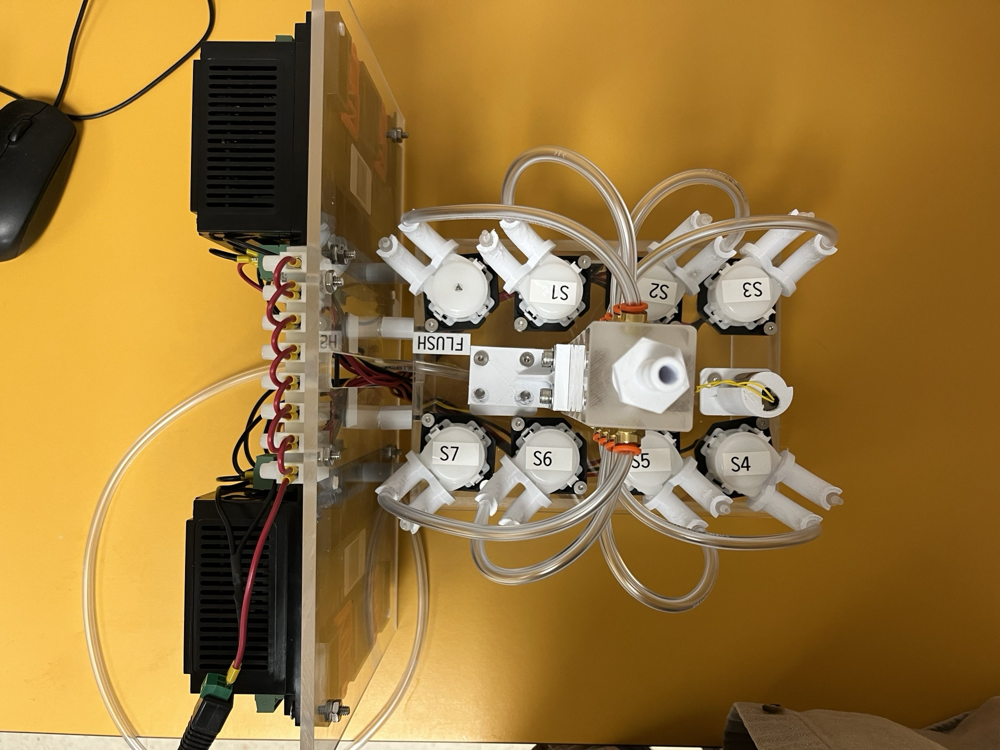

# Deploying Super-Sipper

Super-Sipper is a PhytO-ARM configuration for sampling multiple bottle samples with a single IFCB. PhytO-ARM coordinates sipper actions in conjunction with synchronous IFCB sample collection.

## Initial Setup - Hardware Dependencies
### Requirements for Super-Sipper Setup:
- IFCB
    - Note: the IFCB can either be running the base McLane image or operating as a headless unit with containerized IFCBAcquire
- RaspberryPi 5 (rPi5) to run PhytO-ARM
- Super-Sipper manifold

<p align="center">
     <i>OSU/NWFSC Super-Sipper Configuration</i>
</p>


### Network Configuration
The IFCB, digital loggers, and rPi unit need to be on the same local network.

Users will need the IP addresses for the following components:

- rPi
- IFCB
- Digital Logger #1
- Digital Logger #2

## Installation of Super-Sipper on rPi - skip if unit has Super-Sipper pre-installed
If PhytO-ARM has not been previously installed on the rPi unit, follow the installation steps in the main [PhytO-ARM README](https://github.com/WHOIGit/PhytO-ARM/blob/dcd7d4064e0d8783ed86763b99b0ad49c00cecbc/README.md). 

Connect to the rPi:

    ssh hablab@[rPi IP Address]
    pw: [PW]

On the rPi, confirm you are on the proper PhytO-ARM branch: nathan.figueroa/super-sipper.

First, navigate to the PhytO-ARM directory on the rPi:

    cd PhytO-ARM

Then, check which branch you are on:

    git branch


If you are not on the super-sipper branch, navigate to it:

    git checkout nathan.figueroa/super-sipper


**For first-time installations of PhytO-ARM on an rPi**: after checking out the super-sipper branch, confirm that the correct image (version) has been loaded:

    docker pull whoi/phyto-arm:nathan.figueroa-super-sipper


## Running Super-Sipper on rPi

Connect the rPi unit to a desktop computer using the included HDMI cord. Use the provide username and pw.

### Update Super-Sipper Config

Unless significant changes need to be made to the super-sipper sequence, users will only need to update the super-sipper config file after PhytO-ARM has been installed.

Navigate to super_sipper_NWFSC.yaml in a new terminal window on the rPi unit:
```
cd PhytO-ARM/configs/super_sipper_NWFSC.yaml
```

The base configuration is set up as follows. Pay special attention to the comments below to indicate areas that will likely need to be updated for user-specific deployments.

```bash
name: Super-Sipper NWFSC

# do not make changes
launch_args:
    log_dir: /data/roslogs/
    rosbag_prefix: /data/rosbags/phyto-arm
    classifier: false
    ifcb_winch: false
    chanos_winch: false
    digital_logger: false

# optional, update the URL to recieve slack alerts if the super-sipper system crashes
alerts:
    # You can post alert messages to Slack by creating an Incoming Webhook for your channel:
    - type: slack
      url: https://hooks.slack.com/services/...

# do not make changes
lock_manager:
    # Use this to control how many motors can be in motion at once.
    max_moving_winches: 1

# users will need to update this section with IFCB-specific details
ifcb:
    address: "IFCB IPADDR" # update with IFCB ip address
    port: 8092
    serial: "111-111-###" # update with IFCB serial number
    routines_dir: "/routines"
    # This path is interpreted by IFCBacquire, which may be in another container or namespace. Unless routines are moved on the rPi to another directory that is not /hablab/routines, this will not change. 
    data_dir: "/home/ifcb/ifcbdata/testing" # This is the parent directory for all data. Can change to be super-sipper specific. 

# this section can be modified with super-sipper specific configuration details and metadata
arm_sipper: #optional
    task_durations: 
        flush_pump: 15 # seconds
        drain_valve_open: 35
        sample_pump: 15
        ifcb_valve_open: 60
    non_sample_power:
        seawater_pump:
            digital_logger: digital_logger_1
            outlet: flush_pump
        drain_valve:
            digital_logger: digital_logger_2
            outlet: drain_valve
        ifcb_valve:
            digital_logger: digital_logger_2
            outlet: ifcb_valve
    starting_sample_index: 0 # start with first sample, change this if you need to start with another sample
    samples: # Order of config drives the sequence of samples, top to bottom.
        - name: example_name_1 #optional. Name of a sample. Must be unique.
          ifcb_subdir: "samples/1"
          power:
            digital_logger: digital_logger_1 
            outlet: sample_pump_1
          metadata: 
            location: "A" # Any metadata you want to add to the sample will create topic, e.g. /arm_sipper/sample_metadata/location
            depth: 10.0 # meters
            time: "2025-01-01 12:00:00"
            method: "IFCB"
        - name: example_name_2 #optional. Name of a sample. Must be unique.
          ifcb_subdir: "samples/2"
          power:
            digital_logger: digital_logger_1 
            outlet: sample_pump_2
          metadata:
            location: "B"
            depth: 8.0 # meters
            time: "2025-01-01 12:00:00"
            method: "IFCB"
        - name: example_name_3 #optional. Name of a sample. Must be unique.
          ifcb_subdir: "samples/3"
          power:
            digital_logger: digital_logger_1 
            outlet: sample_pump_3
          metadata:
            location: "C"
            depth: 12.0 # meters
            time: "2025-01-01 12:00:00"
            method: "IFCB"
        - name: example_name_4 #optional. Name of a sample. Must be unique.
          ifcb_subdir: "samples/4"
          power:
            digital_logger: digital_logger_1 
            outlet: sample_pump_4
          metadata:
            location: "D"
            depth: 6.0 # meters
            time: "2025-01-01 12:00:00"
            method: "IFCB"
        - name: example_name_5 #optional. Name of a sample. Must be unique.
          ifcb_subdir: "samples/5"
          power:
            digital_logger: digital_logger_1 
            outlet: sample_pump_5
          metadata:
            location: "E"
            depth: 2.0 # meters
            time: "2025-01-01 12:00:00"
            method: "IFCB"
        - name: example_name_6 #optional. Name of a sample. Must be unique.
          ifcb_subdir: "samples/6"
          power:
            digital_logger: digital_logger_1 
            outlet: sample_pump_6
          metadata:
            location: "F"
            depth: 1.0 # meters
            time: "2025-01-01 12:00:00"
            method: "IFCB"
        - name: example_name_7 #optional. Name of a sample. Must be unique.
          ifcb_subdir: "samples/7"
          power:
            digital_logger: digital_logger_1 
            outlet: sample_pump_7
          metadata:
            location: "G"
            depth: 4.0 # meters
            time: "2025-01-01 12:00:00"
            method: "IFCB"
        # Add more samples as needed
        # Add more samples as needed
    digital_loggers:
        digital_logger_1: #optional. Name of the digital logger. Must be unique.
            username: "user" # this will need to be updated
            password: "pw" # this will need to be updated
            address: "IPADDR" # this will need to be updated
            outlets: # 
                - name: "flush_pump"
                  outlet: 1
                - name: "sample_pump_1"
                  outlet: 2
                - name: "sample_pump_2"
                  outlet: 3
                - name: "sample_pump_3"
                  outlet: 4
                - name: "sample_pump_4"
                  outlet: 5
                - name: "sample_pump_5"
                  outlet: 6
                - name: "sample_pump_6"
                  outlet: 7
                - name: "sample_pump_7"
                  outlet: 8

        digital_logger_2: #optional. Name of the digital logger. Must be unique.
            username: "user" # this will need to be updated
            password: "pw" # this will need to be updated
            address: "IPADDR" # this will need to be updated
            outlets:
                - name: "drain_valve"
                  outlet: 1
                - name: "ifcb_valve"
                  outlet: 2

# adjust this as needed
    ifcb_maintenance:
        # Prime sample tube between samples?
        prime_sample_tube: true
        # Interval at which we run a cartridge debubble, necessary when IFCB on its side
        cartridge_debubble_interval: 0 # minutes, 0 = never
        # Interval at which we run a biocide and bleach
        clean_interval: 0  # minutes, 0 = never
        # Interval at which we run a debubble and bead sample. Make this a multiple of 
        # the clean interval if you want a clean after each bead sample.
        bead_interval: 1440  # minutes, 0 = never

```

### Starting Super-Siper

Confirm that the IFCB is powered up. Start IFCBAcquire and confirm that webUI is loading properly using normal IFCB desktop applications. Consider running a cleaning cycle or a debubble to confirm DAQ and fluids ports are working properly.

Next, on the rPi, confirm that the IFCB and two digital logger switches are all reachable on the local network from the rPi:


    eg. ping 192.168.13.2 


From the home window on the rPi, you should see two Desktop icons: PhytO-ARM Super Sipper and PhytO-ARM kill. You can use these shortcuts to start and stop PhytO-ARM.


Now back in the main rPi terminal window, confirm that the webnode is publishing data correctly:

```
curl http://localhost:8098
```
Example output: 
```
hablab@papi2:~/PhytO-ARM$ curl http://localhost:8098
{"location": "G", "depth": "4.0", "time": "2025-01-01 12:00:00", "method": "IFCB"}
```
The web node automatically discovers and publishes all metadata fields defined in the `arm_sipper.samples[].metadata` sections. Only the metadata fields from the currently active sample will be shown - when switching samples, fields not present in the new sample are automatically removed from the response.


Finally, confirm that the IFCB custom routine loaded and the IFCB is sampling as expected on the webUI.

### Stopping Super-Sipper
To abort PhytO-ARM, click the PhytO-ARM kill shortcut.
